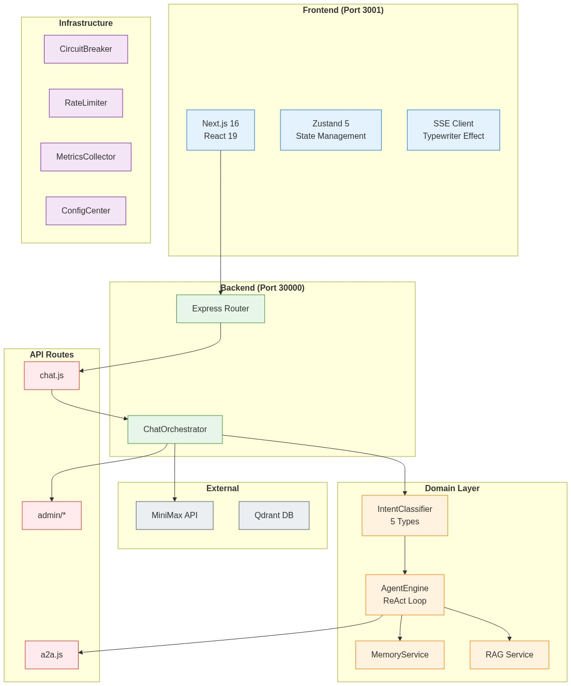

# SimpleAgent

现代化 AI 对话平台，基于 React 19 + Next.js 16 + Express 构建。

[](https://github.com/Shyu-x/SimpleAgent/actions)
[](https://nodejs.org/)
[](https://nextjs.org/)
[](LICENSE)

## 功能特性

- SSE 流式响应，打字机效果
- MiniMax Token Plan API 集成 (M2.7, VL-01, image-01)
- 意图检测与澄清机制
- ReAct Agent 引擎，工具调用
- RAG 知识库，混合检索 (向量 + 关键词)
- 多 Agent 协作 (A2A 协议)
- HITL 人机协作确认
- 企业级管理后台

## 技术架构



```
+------------------------------------------------------------------+
|                      前端 (Port 3001)                              |
|   React 19 + Next.js 16 + Zustand 5 + TypeScript                 |
+------------------------------------------------------------------+
                              SSE
+------------------------------------------------------------------+
|                      后端 (Port 30000)                             |
|   Node.js + Express + 分层架构                                    |
+------------------------------------------------------------------+
                              API
+------------------------------------------------------------------+
|                      MiniMax API (外部服务)                        |
|   M2.7 / VL-01 / image-01                                        |
+------------------------------------------------------------------+
```

### 后端分层架构

```
backend/src/
├── application/     # 应用编排层
├── domain/          # 核心业务逻辑 (model/rag/agent/search)
├── infra/           # 基础设施 (metrics/alert/config/queue)
├── common/          # 通用工具 (errors/)
├── routes/          # API 端点 (30+ 路由)
└── services/        # 业务逻辑层
```

## 快速开始

### 环境要求

- Node.js 18+
- npm 9+ 或 pnpm 8+
- MiniMax API Key (Token Plan)

### 后端安装

```bash
cd backend
npm install
cp ../.env.example .env
# 编辑 .env，添加你的 MINIMAX_API_KEY
npm start
# 运行在端口 30000
```

### 前端安装

```bash
cd frontend
npm install
npm run dev
# 运行在端口 3001
```

访问 http://localhost:3001

### 环境变量

```env
# 后端 (.env)
MINIMAX_API_KEY=your_token_plan_api_key
PORT=30000

# 前端 (.env.local)
NEXT_PUBLIC_BACKEND_URL=http://localhost:30000
```

## 技术栈

| 层次 | 技术 |
|------|------|
| 前端 | React 19, Next.js 16, Zustand 5, TypeScript |
| 后端 | Express, Node.js, SSE |
| AI 模型 | MiniMax M2.7 (Token Plan) |
| 向量库 | Qdrant (可选), 内存 (默认) |
| 基础设施 | Prometheus 指标, Redis 缓存 |

## 核心模块

### 意图检测

五种意图类型，低置信度时触发澄清：
- `tool_use`: 工具执行请求
- `knowledge`: RAG 知识查询
- `creative`: 创意生成
- `task`: 任务执行
- `conversation`: 日常对话

### Agent 引擎

ReAct (推理 + 行动) 执行循环：
- Thought: 分析当前状态和目标
- Action: 选择并执行工具或 LLM
- Observation: 处理结果
- 循环直到完成或达到最大迭代次数

### RAG 流水线

1. Query Rewrite - 补全不完整查询
2. Query Decompose - 拆分复杂问题
3. Hybrid Search - 向量 + 关键词检索
4. Reranking - 多策略融合 (CrossEncoder, BM25, Semantic, Diversity)
5. Citation Assembly - 来源追溯

### 企业级功能

- 熔断器，自动故障转移
- 队列限流
- Prometheus 指标端点
- 配置热更新
- 优先级任务队列
- 告警管理 (critical/warning/info)

## 性能指标

基准测试结果 (2026-03-18):

| 任务 | 方法 | 准确率 | 延迟 |
|------|------|--------|------|
| 意图分类 | 关键词匹配 | 70% | <1ms |
| 工具选择 | 关键词匹配 | 90% | <1ms |

| 模式 | 耗时 | 加速比 |
|------|------|--------|
| 串行 (10 任务) | 620ms | 1.0x |
| 并行 4 并发 | 186ms | 3.3x |

## 文档

- [CLAUDE.md](./CLAUDE.md) - 项目指令和架构
- [CHANGELOG.md](./CHANGELOG.md) - 版本历史
- [docs/](docs/) - 技术文档

## 许可

AGPL-3.0 - 详见 [LICENSE](LICENSE) 文件

## 参考资源

- [Next.js 文档](https://nextjs.org/docs)
- [React 19](https://react.dev)
- [Model Context Protocol](https://modelcontextprotocol.io)
- [ReAct: 推理与行动协同](https://arxiv.org/abs/2210.03629)