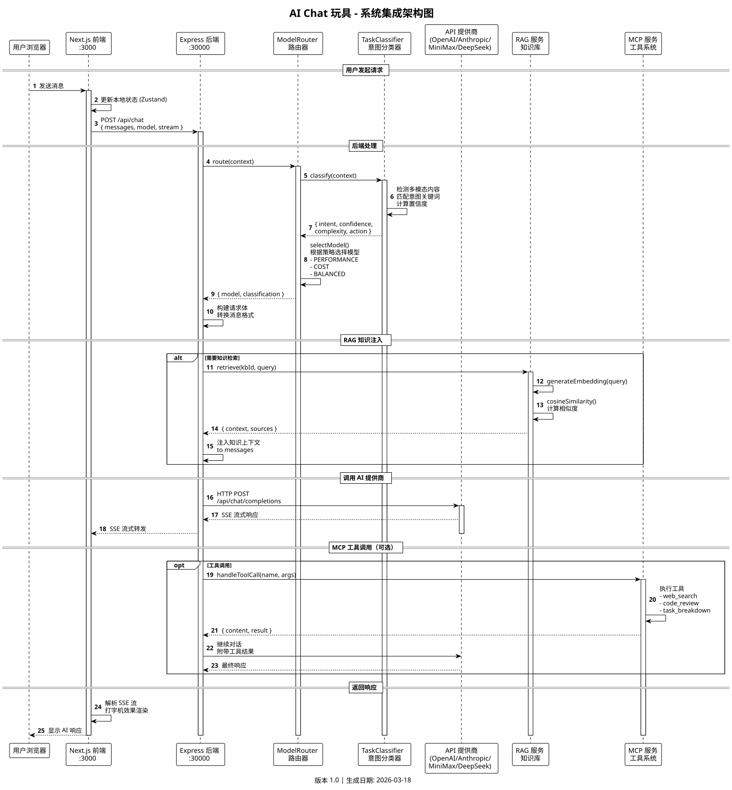
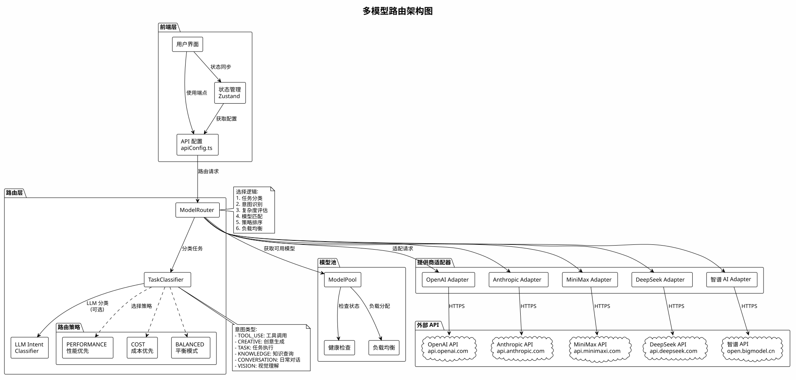
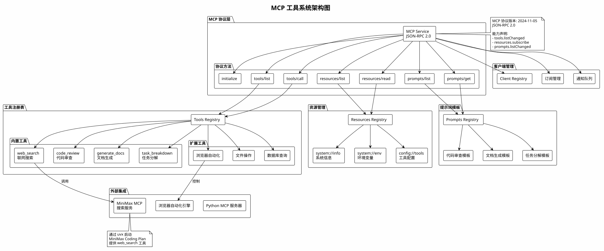
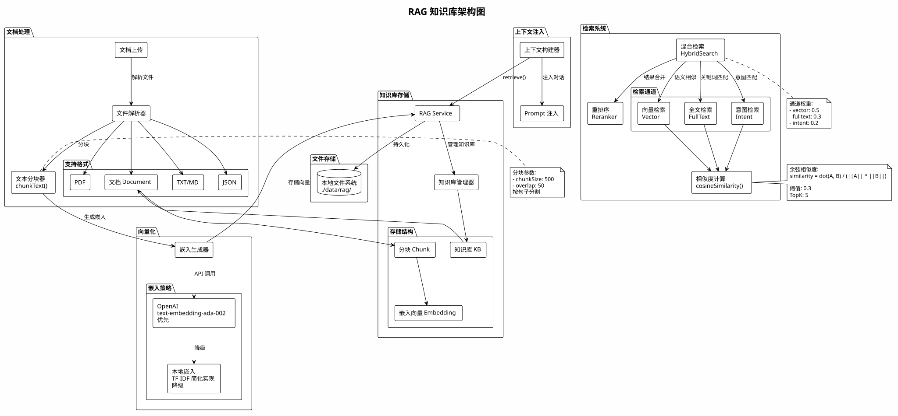
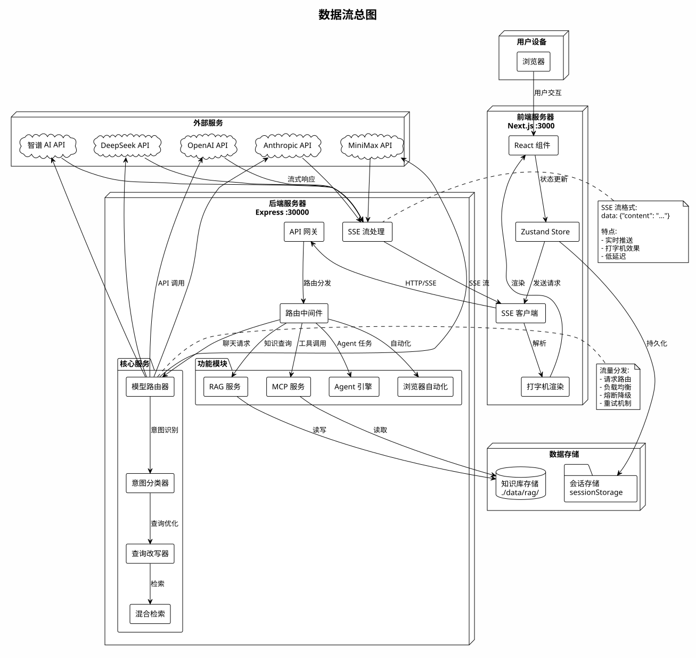

# AI Chat 玩具 - 框架文档

现代化AI对话平台 - 完整架构文档索引

## 📋 项目概述

AI Chat 玩具 是一个功能完整的AI对话平台，支持：

- **多提供商**：支持 OpenAI、Anthropic、Google、MiniMax、DeepSeek、智谱AI 等
- **多模态**：支持文本、图片、语音输入输出
- **Agent系统**：内置多Agent协作引擎，支持工具调用
- **RAG知识库**：内置检索增强生成系统
- **联网搜索**：支持 Jina AI、MiniMax、DuckDuckGo 实时搜索
- **浏览器自动化**：支持 Puppeteer 浏览器控制
- **流式响应**：SSE 流式输出 + 打字机动画效果
- **响应式设计**：完美适配移动端、平板、桌面

## 🛠️ 技术栈

| 层级 | 技术 | 版本 |
|------|------|------|
| 前端框架 | React | 19 |
| 全栈框架 | Next.js | 16 |
| 状态管理 | Zustand | 5 |
| CSS框架 | Tailwind CSS | 4 |
| 后端框架 | Express | 4 |
| 运行时 | Node.js | 20+ |
| 标记渲染 | ReactMarkdown + Shiki | - |
| XSS防护 | DOMPurify | - |
| 动画 | Framer Motion | - |

## 📊 完整架构图汇总

> ⚠️ **渲染说明**: 由于公共 PlantUML 服务器有请求限制，部分 SVG 需要本地渲染。
> 请使用 VSCode PlantUML 插件打开 `.puml` 文件查看，或运行 `node scripts/render-puml-v3.js` 重新渲染。

### 高层架构 (C4 Model)

| 图 | 状态 | SVG 预览 | 说明 |
|----|------|---------|------|
| 系统总览 | ⚠️ 需本地渲染 | [PUML](./overview.puml) | 高层C4上下文图，展示系统上下文关系 |
| 部署架构 | ⚠️ 需本地渲染 | [PUML](./deployment-arch.puml) | 部署拓扑图，展示节点分布（开发/生产）|

### 前端架构

| 图 | 状态 | SVG 预览 | 说明 |
|----|------|---------|------|
| **前端整体架构** | ⚠️ 需本地渲染 | [PUML](./frontend-arch.puml) | 框架层/类型层/状态层/工具层/组件层分层结构 |
| **页面结构图** | ⚠️ 需本地渲染 | [PUML](./frontend-arch.puml) | 主页面布局（移动端/桌面端）|
| **组件依赖关系** | ⚠️ 需本地渲染 | [PUML](./frontend-arch.puml) | 组件从基础到上层的依赖关系 |
| **状态管理图** | ⚠️ 需本地渲染 | [PUML](./frontend-arch.puml) | Zustand ChatStore 的状态和方法 |
| **API调用流程图** | ⚠️ 需本地渲染 | [PUML](./frontend-arch.puml) | SSE流式响应完整流程 |
| **组件树分层** | ⚠️ 需本地渲染 | [PUML](./frontend-arch.puml) | 从入口到叶子组件的完整树 |

### 后端架构

| 图 | 状态 | SVG 预览 | 说明 |
|----|------|---------|------|
| **后端整体架构** | ⚠️ 需本地渲染 | [PUML](./backend-arch.puml) | 入口/中间件/路由/服务/数据分层 |
| **请求处理流程图** | ⚠️ 需本地渲染 | [PUML](./backend-arch.puml) | 从请求接收到响应返回完整流程 |
| **中间件层级图** | ⚠️ 需本地渲染 | [PUML](./backend-arch.puml) | 从外到内的中间件调用顺序 |
| **会话管理图** | ⚠️ 需本地渲染 | [PUML](./backend-arch.puml) | 会话CRUD和存储结构 |
| **SSE流式响应** | ⚠️ 需本地渲染 | [PUML](./backend-arch.puml) | 端到端SSE流式响应 |

### Agent 系统架构 (MiniMax M2.7)

| 图 | 状态 | SVG 预览 | 说明 |
|----|------|---------|------|
| **Agent执行循环** | ⚠️ 需本地渲染 | [PUML](./agent-arch.puml) | MiniMax Agent 完整推理执行循环 |
| 工具系统类图 | ⚠️ 需本地渲染 | [PUML](./agent-arch.puml) | 工具系统完整类图 |

### 系统集成架构

| 图 | 状态 | SVG 预览 | 说明 |
|----|------|---------|------|
| **端到端请求流程** | ✅ 已渲染 |  | 用户→前端→后端→LLM完整流程 |
| **多模型路由架构** | ✅ 已渲染 |  | 模型路由层的组件和选择策略 |
| **MCP工具系统** | ✅ 已渲染 |  | MCP协议层/工具注册表/资源管理 |
| **RAG知识库架构** | ✅ 已渲染 |  | 文档处理→向量化→检索→注入全流程 |
| **数据流总图** | ✅ 已渲染 |  | 从用户到LLM的完整数据流 |

### 本地渲染指南

如需重新渲染所有 PlantUML 图，请安装 PlantUML 插件：

1. **VSCode**: 安装 "PlantUML" 插件，右键 `.puml` 文件选择 "Preview"
2. **命令行**: 运行 `npm install -g plantuml` 然后 `plantuml -tsvg *.puml`
3. **Docker**: `docker run -v $(pwd):/data plantuml/plantuml -tsvg /data/*.puml`

## 🏗️ 架构分层 ASCII 概览

```
┌─────────────────────────────────────────────────────────────┐
│                        用户浏览器                              │
└─────────────────────────────────────────────────────────────┘
                              ↓ HTTP/SSE
┌─────────────────────────────────────────────────────────────┐
│                     前端层 (Next.js 16)                       │
│  ┌─────────────┐ ┌─────────────┐ ┌────────────────────────┐  │
│  │ React 19 UI │ │ Zustand Store│ │ SSE Client + 打字机效果│  │
│  └─────────────┘ └─────────────┘ └────────────────────────┘  │
└─────────────────────────────────────────────────────────────┘
                              ↓ JSON API
┌─────────────────────────────────────────────────────────────┐
│                     后端层 (Express.js)                       │
│  ┌─────────────┐ ┌──────────────┐ ┌──────────────────────┐  │
│  │ API 路由    │ │ 意图分类器     │ │ 多模型路由器          │  │
│  └─────────────┘ └──────────────┘ └──────────────────────┘  │
│  ┌─────────────┐ ┌──────────────┐ ┌──────────────────────┐  │
│  │ Agent 引擎  │ │ 工具注册表     │ │ MCP 工具系统         │  │
│  └─────────────┘ └──────────────┘ └──────────────────────┘  │
│  ┌─────────────┐ ┌──────────────┐ ┌──────────────────────┐  │
│  │ RAG 服务    │ │ 混合检索       │ │ 记忆管理             │  │
│  └─────────────┘ └──────────────┘ └──────────────────────┘  │
└─────────────────────────────────────────────────────────────┘
          ┌──────────────┐ ┌──────────────┐ ┌──────────────┐
          ↓              ↓                ↓
┌──────────────────┐ ┌────────────┐ ┌────────────────────────┐
│ 外部LLM提供商     │ │ 联网搜索    │ │ 浏览器自动化            │
│ (OpenAI/Anthropic │ │ (Jina/     │ │ (Puppeteer)            │
│  Google/MiniMax)  │ │  MiniMax)  │ │                        │
└──────────────────┘ └────────────┘ └────────────────────────┘
```

## 💡 关键设计决策

### 1. 前后端分离

**决策**: 前后端完全分离，前端 Next.js，后端 Express 独立服务

**原因**:
- 清晰的职责分离
- 独立扩缩容
- 便于前后端并行开发
- 支持独立部署

### 2. 多模型路由层

**决策**: 所有LLM请求经过后端路由层转发

**原因**:
- 统一API接口格式
- 便于熔断限流
- 隐藏API密钥，提高安全性
- 支持负载均衡和故障转移
- 支持模型 fallback

### 3. Agent 即服务

**决策**: Agent逻辑完全在后端实现

**原因**:
- 可以进行多轮推理迭代
- 工具调用不暴露给前端
- 便于添加缓存和日志
- 保护敏感信息

### 4. SSE 流式响应

**决策**: 使用 Server-Sent Events 替代 WebSocket

**原因**:
- 协议更简单，代理兼容性好
- 自动重连
- 单向通信足够满足对话场景
- 减少后端复杂度

### 5. API 密钥客户端存储

**决策**: API Key 存在浏览器 sessionStorage

**原因**:
- 用户完全掌控自己的密钥
- 后端不需要存储敏感数据
- 切换用户/浏览器无需重新配置
- 零成本扩展用户数

### 6. 内存知识库

**决策**: RAG向量存储默认在内存

**原因**:
- 开发环境零依赖
- 原型验证快速
- 生产环境可替换为向量数据库
- 不影响核心逻辑

## 🔄 数据流

1. **用户输入** → 前端UI → Zustand状态 → API请求 → 后端
2. **意图分析** → 后端任务分类器 → 判断是否需要工具/Agent
3. **工具执行** → 工具注册表选择工具 → 提取参数 → 执行工具
4. **知识检索** → 如果需要外部知识 → RAG混合检索 → 获取上下文
5. **LLM调用** → 多模型路由器选择提供商 → 转发请求 → SSE流式返回
6. **前端渲染** → SSE客户端接收 → 打字机效果 → 增量渲染 → Markdown解析

## 🎯 架构特点

- **可扩展**: 工具系统模块化，易于添加新工具
- **多模型**: 支持几乎所有主流LLM提供商
- **高性能**: 流式响应，后端无状态，水平扩展
- **安全**: API密钥不经过后端存储，XSS防护
- **开发者友好**: 清晰分层，模块化，文档完整

## 📁 项目文档索引

| 文档 | 位置 | 说明 |
|------|------|------|
| 架构设计方案 | [../架构设计方案.md](../架构设计方案.md) | 完整架构设计文档 |
| 架构分析改良报告 | [../架构分析改良报告.md](../架构分析改良报告.md) | 架构评估与改进 |
| 源码详细分析报告 | [../源码详细分析报告.md](../源码详细分析报告.md) | 代码结构分析 |
| 技术调研与选型报告 | [../技术调研与选型报告.md](../技术调研与选型报告.md) | 技术选型调研 |
| MiniMax M2.7 API 调研 | [../MiniMax-M2.7-API-调研.md](../MiniMax-M2.7-API-调研.md) | MiniMax M2.7 API 完整调研 |
| 功能评估 | [../功能评估.md](../功能评估.md) | 功能完整性评估 |
| 功能测试文档 | [../功能测试文档.md](../功能测试文档.md) | 测试用例与验收标准 |
| 部署指南 | [../DEPLOYMENT.md](../DEPLOYMENT.md) | 部署说明 |
| 浏览器自动化 | [../BROWSER_AUTOMATION_PLAYBOOK.md](../BROWSER_AUTOMATION_PLAYBOOK.md) | 浏览器自动化手册 |
| AI-Chat开发手记 | [../AI-Chat开发手记.md](../AI-Chat开发手记.md) | 开发过程记录 |

## 📌 版本信息

- 最后更新: **2026-03-18**
- 架构版本: **v2.0**
- 维护者: AI Chat 项目团队

---

> 💡 **查看 PlantUML 图**: 使用 VSCode PlantUML 插件或 [PlantUML 在线服务器](https://www.planttext.com/) 渲染