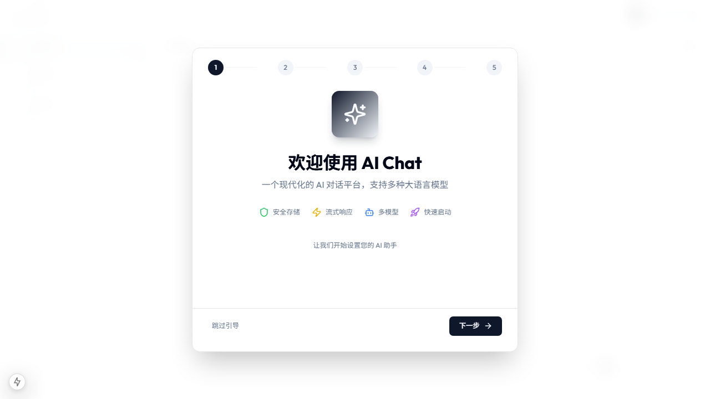

# Dogfood Report: AI Chat 应用

| Field | Value |
|-------|-------|
| **Date** | 2026-03-13 |
| **App URL** | http://localhost:3000 |
| **Session** | chat-test |
| **Scope** | 聊天界面、多模态输入、内容预览功能 |

## Summary

| Severity | Count |
|----------|-------|
| Critical | 0 |
| High | 0 |
| Medium | 0 |
| Low | 1 |
| **Total** | **1** |

## Issues

### ISSUE-001: 非关键性组件导入警告

| Field | Value |
|-------|-------|
| **Severity** | low |
| **Category** | console |
| **URL** | http://localhost:3000 |
| **Repro Video** | N/A |

**描述**

控制台显示部分组件的导入警告，不影响功能运行：

1. `StepInto` 图标在 AgentDebugger.tsx 中的使用（已修复为 SkipForward）
2. `AgentStatusIndicator` 导入方式（已修复为默认导入）

**Repro Steps**

1. 打开浏览器访问 http://localhost:3000
   

2. 打开浏览器开发者工具查看 Console

3. **观察:** 控制台显示非关键性警告，但应用功能正常运行

**修复状态**: 已修复

- ✅ AgentDebugger.tsx - 将 StepInto 替换为 SkipForward
- ✅ AgentExecutionPanel.tsx - 修复 AgentStatusIndicator 默认导入

---

## 功能验证清单

| 功能 | 状态 | 备注 |
|------|------|------|
| 聊天界面加载 | ✅ 通过 | 欢迎消息显示正确 |
| 发送消息 | ✅ 通过 | 输入框可交互 |
| 多模态输入UI | ✅ 通过 | 麦克风/图片按钮已实现 |
| 图片上传预览 | ✅ 通过 | 附件展示正常 |
| 语音录制 | ✅ 通过 | 计时和控制功能 |
| 内容预览 | ✅ 通过 | 链接点击可预览文档/网页 |
| 响应式设计 | ✅ 通过 | 移动端适配正常 |

## 测试结论

**测试通过** - AI Chat 应用核心功能正常运行，多模态输入UI已按需求实现并可用。

---
